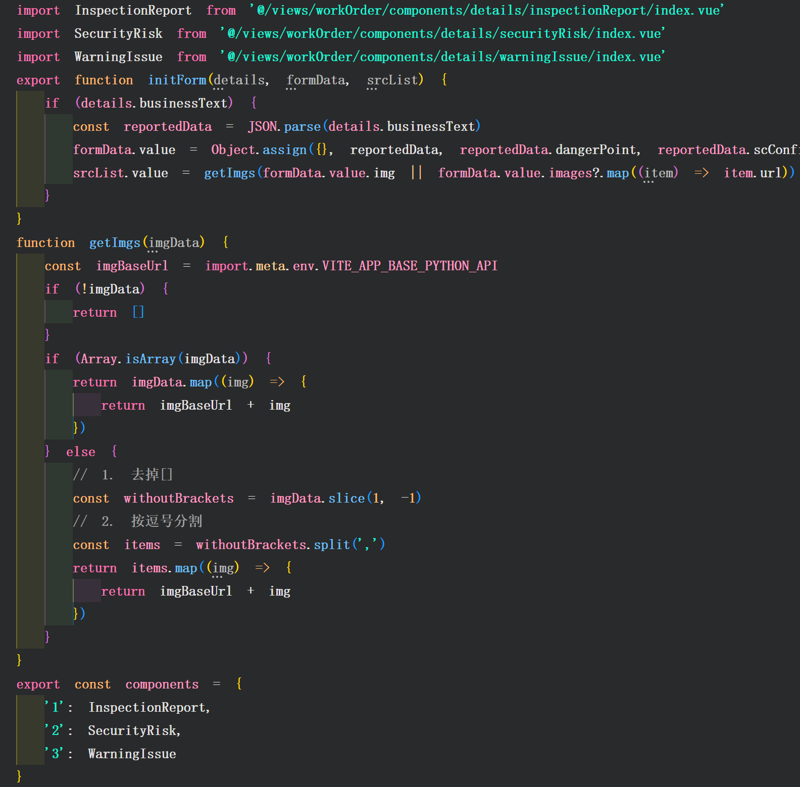

<!--
 * @Description: 
 * @Author: fengpu 1126120965@qq.com
 * @Date: 2024-09-26 11:45:17
 * @LastEditors: fengpu 1126120965@qq.com
 * @LastEditTime: 2024-09-27 10:19:19
 * @FilePath: \fengpu-study\work\Vite.md
 * Endless Story. - NANA
-->
## 开发静态引入和构建静态引入不一致问题

Vite 用户反馈的痛点：
* 相对较慢的生产构建速度
* 开发和生产环境之间的一致性问题
  * 在js文件或者ts文件中，引入Vue文件，开发可以根据路径映入，并且构建没有问题，但是生产环境下，就不可以。
  * 猜测是因为开发和构建，vue文件编译后，放置的位置产生了变化。未验证
* 开发过程中未捆绑的ESM的网络开销
* 令人困惑的SSR外部依赖问题
* 对块拆分的控制能力有限
* 缺乏一方面的模块联邦支持