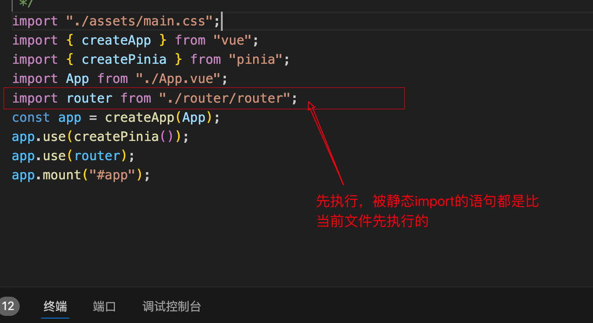

<!--
 * @Description:
 * @Author: fengpu 1126120965@qq.com
 * @Date: 2024-09-13 12:43:41
 * @LastEditors: fengpu 1126120965@qq.com
 * @LastEditTime: 2024-10-25 13:23:57
 * @FilePath: \fengpu\fengpu-study\work\Vue\Pina的理解.md
 * Endless Story. - NANA
-->
<!-- flux -->

## Flux 架构

用于构建前端应用程序的软件架构模式。由 Facebook 提出，解决在基于 MVC 的架构下，构建大型 Web 应用程序时的数据一致性以及数据流混乱的问题。
Flux 基于**单向数据流**，使得应用程序的数据流非常清晰，易于理解和调试。
它是一种描述状态管理的设计模式，绝大多数前端领域的状态管理工具都遵循这种架构，或者以它为参考模型。
Vuex\Pina\Redux 都是 Flux 的一种实现

### Flux 的组成部分

- Store (存储器)
  存储数据和状态，并且状态是只读的，改变只能由 dispatcher 分发的数据改变。
  （Pina 是否不遵循这个规律，Vuex 是状态只能由 commit 改变，但没有尝试过直接改变）
  > Vuex 和 Pina 中，存储的 State 都是响应式的，所以其实直接修改也是可以的，并且可以触发视图更新。
  > 但 Vuex 不建议这样做。状态管理器的初衷就是数据流清晰并且可调式，devtool 监听 state 的修改实际是监听 commit dispatch 的，直接修改会导致开发者工具无法追踪数据的修改
- View（视图）
  根据 store 中的数据，渲染生成的页面，与 store 存在订阅关系
  （Vue 里面的状态就是响应式数据，可以收集视图。）
- Dispatcher（派发器）
  接收 action，分发到 store。
- Action（动作）
  一个简单对象，描述用户与应用程序的交互事件。

### Flux 的数据流

---

## Pina

### Pina 和 Vuex 的区别

- mutation 已被弃用。它们经常被认为是极其冗余的。它们初衷是带来 devtools 的集成方案，但这已不再是一个问题了。
- 无需要创建自定义的复杂包装器来支持 TypeScript，一切都可标注类型，API 的设计方式是尽可能地利用 TS 类型推理。
- 无过多的魔法字符串注入，只需要导入函数并调用它们，然后享受自动补全的乐趣就好。
- 无需要动态添加 Store，它们默认都是动态的，甚至你可能都不会注意到这点。注意，你仍然可以在任何时候手动使用一个 Store 来注册它，但因为它是自动的，所以你不需要担心它。
- 不再有嵌套结构的模块。你仍然可以通过导入和使用另一个 Store 来隐含地嵌套 stores 空间。虽然 Pinia 从设计上\* 提供的是一个扁平的结构，但仍然能够在 Store 之间进行交叉组合。你甚至可以让 Stores 有循环依赖关系。
- 不再有可命名的模块。考虑到 Store 的扁平架构，Store 的命名取决于它们的定义方式，你甚至可以说所有 Store 都应该命名。

### 组件外的 pina

- 在组件外的 Pina，需要注意引入顺序(Vuex 也有这样的问题吗？因为 router 的映入方式)
  

### Store

### getter

### action
