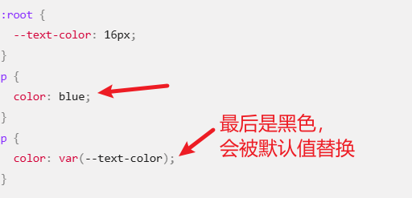

# CSS 自定义属性
  * 又称CSS变量或者级联变量。
  * 使用var()函数来获取值。
  * 受级联约束，可以从父级继承值。
## 基本用法
  * 声明一个自定义属性，属性名需要以两个减号（--）开始，属性值则可以是任何有效的 CSS 值。
  * :root 伪类上设置自定义属性，可以在整个文档中使用。
  * 备用值
  ```
  background-color: var(
    --my-var,
    --my-background,
    pink
  ); /* Invalid: "--my-background, pink" */
  ```
## 有效性和值
  计算时有效性。
  >当 CSS 属性 - 值对中存在语法错误，该行则会被忽略。然而如果自定义属性的值无效，它并不会被忽略，从而会导致该值被覆盖为默认值。
  